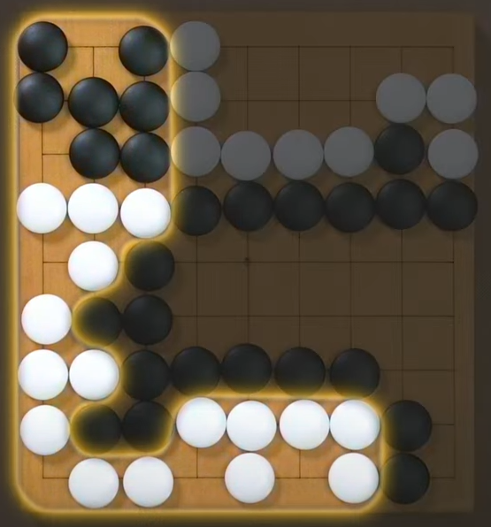
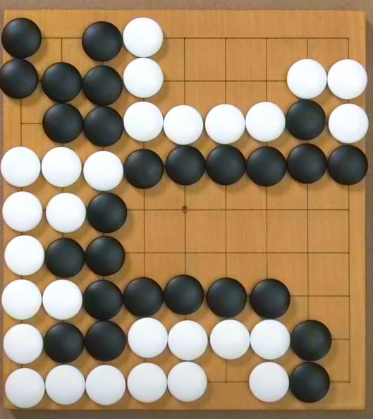

# Go
Go Project for ME4101A
deployed at https://pleonexia-jian.github.io/Go/

Further tasks:
Scoring
scoring is a little too hard? assuming that we are using chinese Go rules(weiqi), the scoring system would still need to be
able to identify territories and seki. in Seki(neutral territory fully surrounded by either players), players need to fill in 
the empty points with their color to get more points. They would fill in false eyes in the seki as well to get more points.
Therefore, the computer would need to be able to identify false eyes as well. However, the computer cannot fill in real eyes 
or they will put themselves in self-capture or being up for capture.

For neutral territory, the computer would either fill in the teritory and count the stones or I would have a algo to identify
if fully surrounded by a solid color. If the computer fill in the teritory, they need to make eyes and not fill it all in
to perform self-capture or put themselves at risk for capture. If i disable self-capturing and allow placing stones during scoring?
i dont even know how im supposed to identify seki in the first place.

Computer